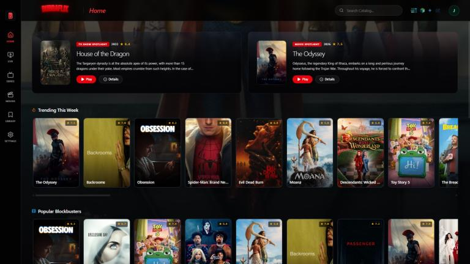

# BubbaFlix Media Center Client (Google TV)

A native Android TV / Google TV client for the BubbaFlix Media Server, featuring a cinematic Netflix-style interface, high-performance streaming, and deep integration with TMDB and TorBox.



## 🎬 Features

- **Netflix-style Dashboard**: An immersive home screen featuring spotlight cards for featured content and horizontal scrolling carousels for "Trending" and "Popular Blockbusters."
- **Navigation Rail**: A persistent, focus-aware left-side navigation sidebar for quick access to Home, Live TV, Movies, Series, and Settings.
- **TMDB Integration**: Rich metadata, ratings, and high-quality artwork sourced directly from The Movie Database.
- **TorBox Streaming**: Seamless streaming integration with the TorBox API, supporting both Torrent and Usenet sources with cached-status indicators.
- **Media3 Video Player**: A robust playback engine powered by AndroidX Media3 (ExoPlayer), featuring custom TV-optimized controls for Play/Pause and seeking.
- **D-Pad Optimized**: Every UI element is designed for a remote-first experience, following Google TV UX guidelines with clear focus indicators.
- **Material 3 (TV)**: Built using the latest `androidx.tv.material3` components with a vibrant Red and Dark brand aesthetic.

## 🛠️ Tech Stack

- **Language**: [Kotlin](https://kotlinlang.org/)
- **UI Framework**: [Jetpack Compose for TV](https://developer.android.com/tv/optimize/compose)
- **Navigation**: [Jetpack Navigation 3](https://developer.android.com/guide/navigation)
- **Video Playback**: [AndroidX Media3 (ExoPlayer)](https://developer.android.com/guide/topics/media/media3)
- **Networking**: [Retrofit](https://square.github.io/retrofit/) & [OkHttp](https://square.github.io/okhttp/)
- **Image Loading**: [Coil for Compose](https://coil-kt.github.io/coil/compose/)
- **Serialization**: [Moshi](https://github.com/square/moshi)

## 🚀 Setup Instructions

### 1. Prerequisites
- Android Studio Ladybug or newer.
- A Google TV / Android TV Emulator (API 34+) or physical device.

### 2. Clone the Repository
```bash
git clone https://github.com/jsanderstechnologies/BubbaFlix-Media-Center.git
cd BubbaFlix-Media-Center
git checkout feature/android-client
```

### 3. Configure API Keys
The app requires valid API keys for TMDB and TorBox. Add these to your `local.properties` file in the project root:

```properties
TMDB_API_KEY=your_tmdb_api_key_here
TORBOX_API_TOKEN=your_torbox_api_token_here
```

### 4. Build and Run
- Sync the project with Gradle files.
- Select the `app` configuration and click **Run**.

## 🎨 Visual Translation
The UI implementation strictly follows the dark-themed, red-accented design provided in the project blueprint. It utilizes `enableEdgeToEdge()` and `WindowInsets` to provide a truly full-screen, cinematic experience.

---
© 2026 Sanders Technologies
